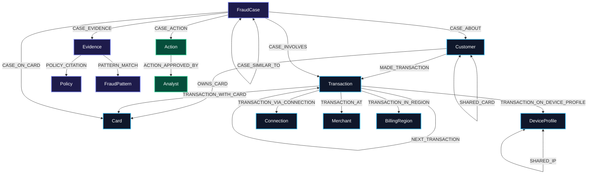

# FraudGraph Schema Architecture & Topology

**Database Engine:** TigerGraph Savanna (GSQL v3)  
**Graph Name:** `FraudGraph`  
**Purpose:** Graph-native Financial Crime & Fraud Investigation System  

---

## 1. Schema Diagram (Mermaid)

---

## 2. Vertex Definitions & Key Attributes

| Vertex Type | Primary ID | Key Attributes | Fraud Investigation Utility |
|---|---|---|---|
| `Customer` | `customer_id` (e.g. `C12382`) | `cumulative_risk_score`, `account_status`, `risk_tier`, `kyc_status` | Cardholder profile and baseline behavior anchor |
| `Card` | `card_id` (e.g. `C12382-K1`) | `card_network`, `card_type`, `issuing_bank`, `card_status`, `is_shared` | Payment token; tracks card compromise and velocity bursts |
| `DeviceProfile` | `device_profile_id` (SHA-256) | `device_info`, `os`, `browser`, `screen`, `device_type`, `proxy_type`, `is_new_device_flag` | Client hardware/software fingerprinting for online CNP fraud |
| `Connection` | `connection_id` / `ip_address` | `ip_address`, `isp`, `country`, `region`, `is_vpn`, `is_proxy`, `is_tor` | Network provenance; detects anonymization networks |
| `BillingRegion` | `region_code` (e.g. `444.0`) | `country_code`, `is_home_country` | Geolocation mismatch and out-of-region card-present fraud |
| `Transaction` | `transaction_id` (e.g. `3514030`) | `amount`, `timestamp`, `channel`, `risk_score`, `product_cd`, `c1-c3`, `d1-d3` | Individual financial authorization under investigation |
| `FraudCase` | `case_id` (e.g. `HHG-001`, `CC-0001`) | `status`, `verdict`, `fraud_probability`, `pattern`, `exposure_usd`, `risk_history` | Institutional system of record and memory store |
| `Evidence` | `evidence_id` | `evidence_type`, `title`, `description`, `weight`, `source_query`, `raw_data` | Atomic factual claims feeding confidence gate |
| `Policy` | `policy_id` (e.g. `R1`..`R10`) | `policy_code`, `title`, `description`, `severity`, `action_required` | Regulatory and bank policy clauses cited in decisions |
| `FraudPattern` | `pattern_id` (e.g. `card_testing`) | `pattern_name`, `pattern_code`, `description`, `detection_query` | Formal typology definitions matched during investigation |
| `Action` | `action_id` | `action_type`, `status`, `approval_event_id`, `target_entity_id`, `payload` | Next-best-action log under strict approval routing |
| `Analyst` | `analyst_id` | `full_name`, `role`, `team`, `approval_authority` | Identity of human reviewers issuing L1/L2 approvals |

---

## 3. Edge Definitions & Justification for Non-Obvious Edges

### Core Entity Edges
* `OWNS_CARD` (`Customer` → `Card`): Direct legal ownership between customer and payment card.
* `MADE_TRANSACTION` (`Customer` → `Transaction`): Temporal attribution of transaction to customer.
* `TRANSACTION_WITH_CARD` (`Transaction` → `Card`): Physical or virtual payment card authorization.
* `TRANSACTION_ON_DEVICE_PROFILE` (`Transaction` → `DeviceProfile`): Connects online transactions to client device profile.
* `TRANSACTION_IN_REGION` (`Transaction` → `BillingRegion`): Connects transaction to merchant/billing region.
* `TRANSACTION_AT` (`Transaction` → `Merchant`): Merchant point of sale endpoint.
* `TRANSACTION_VIA_CONNECTION` (`Transaction` → `Connection`): Network connection IP attribution.

### Non-Obvious & Graph-Native Fraud Topology Edges (With Justifications)

1. **`SHARED_DEVICE_PROFILE` (`Customer` ↔ `Customer`, Undirected)**
   * *Justification:* Exposes multi-account fraud syndicates directly in graph topology without requiring expensive 3-hop join queries (`Customer → Transaction → DeviceProfile ← Transaction ← Customer`).

2. **`SHARED_CARD` (`Customer` ↔ `Customer`, Undirected)**
   * *Justification:* Identifies card compromise rings where stolen credentials are distributed across synthetic identity accounts or criminal associates.

3. **`SHARED_IP` (`DeviceProfile` ↔ `DeviceProfile`, Undirected)**
   * *Justification:* Connects distinct device user-agents operating behind identical proxy/VPN endpoints, exposing coordinated botnets or multi-device emulator fraud.

4. **`NEXT_TRANSACTION` (`Transaction` → `Transaction`, Directed, Ordered by `ts`)**
   * *Justification:* Enables single-hop GSQL path traversals for micro-authorization burst detection (Rule R5 card testing) and sub-hour velocity calculations without in-memory sorting.

5. **`CASE_SIMILAR_TO` (`FraudCase` ↔ `FraudCase`, Undirected, Weighted)**
   * *Justification:* Serves as the institutional memory substrate; stores similarity scores between past closed cases (`CC-xxxx`) and current investigations (`HHG-xxxx`) to visibly influence future case confidence.

6. **`POLICY_CITATION` (`Evidence` → `Policy`)**
   * *Justification:* Creates an unforgeable compliance audit trail linking each factual graph claim directly to mandatory clauses (R1–R10) and FinCEN/FATF regulatory mandates.

7. **`PATTERN_MATCH` (`Evidence` → `FraudPattern`)**
   * *Justification:* Binds discovered topological features (such as 3 sub-$5 authorizations) directly to formal bank typologies (`card_testing`, `out_of_region_use`).

8. **`CASE_ACTION` (`FraudCase` → `Action`)**
   * *Justification:* Immutable log binding investigative findings to discrete next-best-actions with approval routing states (`auto`, `L1`, `L2`).

9. **`ACTION_APPROVED_BY` (`Action` → `Analyst`)**
   * *Justification:* Enforces separation of duties; proves that L1/L2 actions (`BLOCK_CARD`, `BLOCK_ALL_CARDS`, `FILE_REPORT`) received authenticated human sign-off prior to execution.

---
*Schema validated against TigerGraph GSQL v3 DDL — FraudGraph production deployment*
